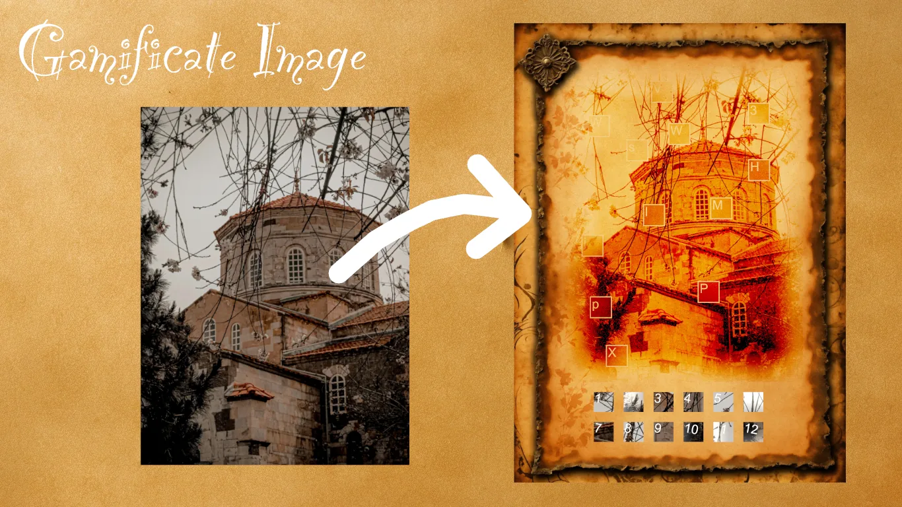

# Gameficate Image



## Usage

```sh
make setup   # one-time: install dependencies (macOS/Homebrew + rustup)
make run     # build + generate output.webp from input.webp
```

The pipeline reads `input.webp` and writes a compressed `output.webp`
(WebP, quality 60, `webp:method=6`). To use a new JPEG input, drop it in as
`input.jpg` — `make run` converts it to `input.webp` automatically
(`make convert QUALITY=80` to convert manually).

Run `make help` for all available targets. Note that make takes **variables,
not positional arguments** — to use custom files, override them with
`NAME=value`:

```sh
make run INPUT=photo.webp OUTPUT=puzzle.webp   # custom input/output
make convert SRC=photo.jpg INPUT=photo.webp    # convert another file
```

### Credits

- [Hagia Sofa in Trabzon](input.webp) by [Gizem İpekçi](https://www.pexels.com/photo/close-up-of-hagia-sofa-in-trazbon-turkey-7746811/) 
- [First Parchment](https://lexica.art/prompt/e88de04a-fcc7-4006-ae9c-af647dd310d9) from Lexica Aperture v3.5
- [Second Parchment](https://lexica.art/prompt/e1228b25-067d-43ff-8b5c-61be0ddf2eee) from Lexica Aperture v3.5
